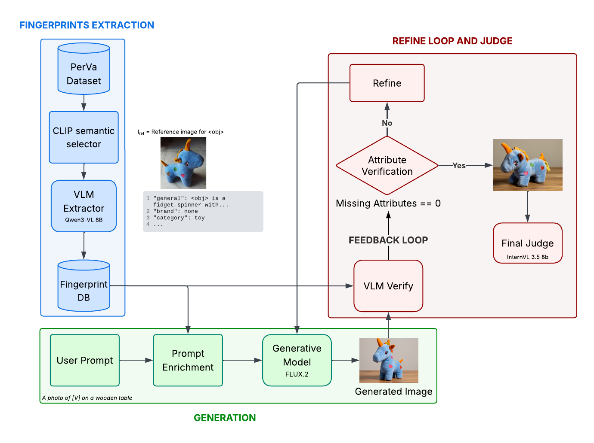

# GRASP - Generative Reasoning for Attribute-Specific Personalization

<p align="center">
  <a href="LICENSE"></a>
  
  
  
  
</p>

---

## Abstract

**GRASP** is a zero-shot, tuning-free framework for subject-driven Text-to-Image personalization. Existing adapter-based methods (e.g., IP-Adapter) suffer from background entanglement and prompt override, while parameter-update approaches (e.g., DreamBooth, LoRA) impose prohibitive computational costs at inference time. Our method addresses both limitations by coupling the native generative power of **FLUX.2**, leveraging its T5 text encoder for dense semantic binding, with the visual reasoning capabilities of **Vision Language Models (VLMs)**. Subject identity is encoded entirely through structured textual fingerprints, eliminating any need for adapter modules or weight fine-tuning. A closed-loop, VLM-guided refinement stage automatically recovers missing visual attributes through escalating prompt revision, and an independent judge model provides the final evaluation.

---

## Key Features

- **Zero-shot, tuning-free**: no adapter weights, no LoRA, no per-subject fine-tuning — the framework runs entirely at inference time.
- **Explicit visual fingerprinting**: Qwen3-VL extracts atomic, human-readable attributes (shape, material, color, pattern, logos, legible text) into a structured JSON database, instead of an opaque embedding.
- **Native FLUX.2 conditioning**: fingerprints are translated into a dense textual anchor and combined with Image-to-Image conditioning, without external adapter modules.
- **Closed-loop verification and refinement**: a Gatekeeper module (CLIP + Qwen3-VL) checks each attribute individually and triggers escalating prompt revisions when attributes are missing, up to 3 recovery attempts.
- **Independent judge**: final outputs are scored by InternVL3.5, decoupled from the Qwen3-VL Gatekeeper used during refinement, to avoid self-evaluation bias.

---

## Pipeline Architecture

GRASP is a five-stage modular pipeline orchestrated by `flux_loop.py`.

<p align="center">
  
</p>

### Stage Details

**1. FINGERPRINTS EXTRACTION**
* **Stage 0. Build Database (`pipeline/build_database.py`):** Processes a subject dataset (PerVA or DreamBench). A text-driven semantic view selection step via CLIP discards noisy views to find the reference image. Qwen3-VL then extracts structured visual fingerprints (logos, textures, typography) and serializes them into `database/database.json`.

**2. GENERATION**
* **Stage 1. Generation (`pipeline/generate.py`):** The JSON fingerprints are translated into a dense Textual Anchor. This anchor and the reference image are passed to FLUX.2-klein-9B in Image-to-Image mode (4 inference steps) to generate the personalized subject without any external adapters.

**3. REFINE LOOP AND JUDGE**
* **Stage 2. Verify Base (`pipeline/verify.py`):** Hierarchical attribute verification. A CLIP quick-reject filters catastrophic failures, followed by a Qwen3-VL logit-based sweep to compute a continuous probability for each attribute. A *Worst-Case Detection* policy flags missing features.
* **Stage 3. Refine (`pipeline/refine.py`):** Rejected images enter a closed recovery loop. Qwen3-VL acts as an automated Prompt Engineer, applying an *Escalating Prompt Revision* strategy (semantic emphasis → hard typographic anchors) and regenerates the image up to 3 times.
* **Stage 4. Final Judge (`pipeline/judge`, `pipeline/metrics`):** To eliminate self-evaluation bias, InternVL3.5-8B evaluates the final outputs using CLIP-I (global identity similarity), CLIP-T (text-image alignment), DINO-I via DINOv2 (fine-grained structural fidelity), and a VQA-based TIFA Score (exact attribute verification).

---

## Repository Structure

```text
GRASP/
├── flux_loop.py               # Main orchestrator for pipeline stages
├── flux_server.py             # HTTP server to keep FLUX.2 resident in VRAM
├── config.py                  # Centralized configuration and model paths
├── build_dashboard.py         # Useful dashboard for results' exploration
├── pipeline/                  # Core pipeline modules
│   ├── __init__.py
│   ├── r2p_tools.py                # Shared utilities
│   ├── build_database.py           # Fingerprinting — Text-driven reference selection strategy
│   ├── build_database_db.py        # Fingerprinting — DreamBench, Centroid strategy
│   ├── build_database_centroid.py  # Fingerprinting — PerVA, Centroid strategy 
│   ├── generate.py                 # FLUX inference — PerVA
│   ├── generate_dreambench.py      # FLUX inference — DreamBench
│   ├── verify.py                   # CLIP/Qwen verification — PerVA
│   ├── verify_dreambench.py        # CLIP/Qwen verification — DreamBench
│   ├── refine.py                   # Prompt rewriting / recovery loop — PerVA
│   ├── refine_dreambench.py        # Prompt rewriting / recovery loop — DreamBench
│   ├── judge.py                    # Final judge (InternVL metrics)
│   ├── evaluate_dreambench.py      # DreamBench evaluation entry point
│   ├── metrics.py                  # Metric computation utilities — PerVA
│   ├── metrics_dreambench.py       # Metric computation utilities — DreamBench
│   ├── prompts/                    # Prompt templates (flux_prompts.py, etc.)
│   └── utils2.py                   # Specific utilities
├── r2p_core/                  # Underlying model wrappers
│   ├── evaluators/            # Confidence calculation logic
│   ├── models/                # Qwen3-VL and InternVL interface logic
│   └── utils/                 # Helpers
├── runs/                      # Slurm cluster scripts for pipeline execution
│   ├── pipeline_dreambench.sh        # Full end-to-end pipeline (build DB + generate + verify + refine)
│   ├── run_ablation_A.sh             # Ablation A — Text Naive
│   ├── run_ablation_B.sh             # Ablation B — Text + Fingerprints
│   ├── run_ablation_C.sh             # Ablation C — Image + Text Naive
│   ├── run_ablation_D.sh             # Ablation D — Image + Fingerprints
│   ├── run_ablation_E.sh             # Ablation E — Full Pipeline (Centroid) — main configuration
│   ├── run_ablation_F.sh             # Ablation F — Full Pipeline (Text-driven)
│   └── run_evaluation_dreambench.sh  # DreamBench evaluation
├── database/                  # Output directory for JSON databases
├── output/                    # Output directory for generated images
└── requirements.txt           # Python dependencies
```

---

## Installation

### Prerequisites

- Python 3.10+
- CUDA-capable GPU (≥ 24 GB VRAM recommended; 40+ GB for full pipeline)
- [Conda](https://docs.conda.io/en/latest/) or a Python virtual environment

### Environment Setup

```bash
# Clone the repository
git clone https://github.com/tommaso-ballarini/GRASP.git
cd GRASP

# Create and activate a conda environment
conda create -n <name-env> python=3.10 -y
conda activate <name-env>

# Install dependencies
pip install -r requirements.txt
```

### Environment Variables

GRASP uses environment variables for flexible path configuration. Copy `.env.example` to `.env` and adjust as needed, or export them directly:

| Variable | Description | Default |
|---|---|---|
| `R2P_CLUSTER_MODE` | Enable cluster path layout (`true`/`false`) | `false` |
| `R2P_MODELS_BASE` | Base directory for locally cached model weights | *(HuggingFace Hub)* |
| `HF_HOME` | Override HuggingFace cache directory | *(HF default)* |
| `R2P_FLUX_MODEL` | Path or repo ID for the FLUX model | `black-forest-labs/FLUX.1-schnell` |
| `R2P_OUTPUT_DIR` | Output directory (cluster mode only) | `output/` |

When `R2P_MODELS_BASE` is not set, all models are downloaded automatically from HuggingFace Hub on first use.

---

## Dataset Preparation

GRASP supports two standard personalization benchmarks:

- **DreamBench**, available at [dreambooth.github.io](https://dreambooth.github.io/)
- **PerVA**, available at [deepayan137.github.io/papers/training-free-personalization](https://deepayan137.github.io/papers/training-free-personalization.html)

Download and place datasets under `data/`.

---

## Usage

All pipeline runs are launched via Slurm through the scripts in `runs/`.

### Ablation studies

Each script reproduces one configuration from Table 1 of the paper:

| Script | Configuration |
|---|---|
| `run_ablation_A.sh` | Text Naive |
| `run_ablation_B.sh` | Text + Fingerprints |
| `run_ablation_C.sh` | Image + Text Naive |
| `run_ablation_D.sh` | Image + Fingerprints |
| `run_ablation_E.sh` | Full Pipeline (Centroid) — main configuration |
| `run_ablation_F.sh` | Full Pipeline (Text-driven) |

---
### Dreambench Comparison
| Script | Configuration |
|---|---|
| `pipeline_dreambench.sh` | Full dreambench pipeline (similar to Run_E) |
| `run_evaluation_dreambench.sh` | Evaluation |

---
### EVALUATION
GRASP uses a four-metric evaluation protocol computed by the **Final Judge** (InternVL3.5-8B), which operates independently from all prior pipeline stages to prevent self-evaluation bias.

| Metric | Model | Measures |
|---|---|---|
| **CLIP-I** | CLIP ViT-L/14 | Global visual identity similarity (generated vs. reference) |
| **CLIP-T** | CLIP ViT-L/14 | Text-image alignment (generated image vs. input prompt) |
| **DINO-I** | DINOv2 ViT-L/14 | Fine-grained structural and semantic fidelity |
| **TIFA Score** | InternVL3.5-8B (VQA) | Exact attribute verification via visual question answering |

Results are written to `output/final_judge_results.json`.

---

## Configuration

All hyperparameters and model paths are centralized in `config.py`. Key settings:

| Config class | Parameter | Default | Description |
|---|---|---|---|
| `Config.Generate` | `BACKGROUND_STYLE` | `wooden_table` | Background template for generation |
| `Config.Refine` | `MAX_ITERATIONS` | `3` | Max refinement attempts per concept |
| `Config.Images` | `OUTPUT_IMAGE_SIZE` | `1024` | Output resolution (px) |

---

## Acknowledgements

This project was developed as part of the Foundation Models course for the Master's degree in Data Science at the University of Trento.
